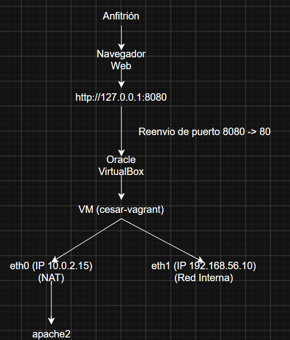
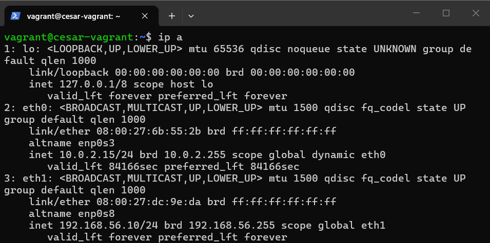
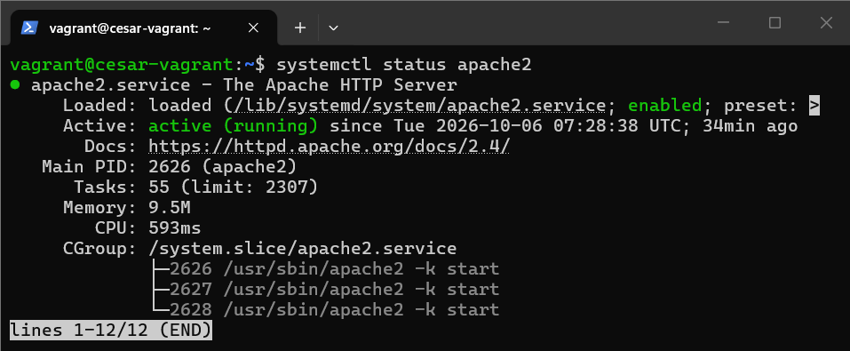
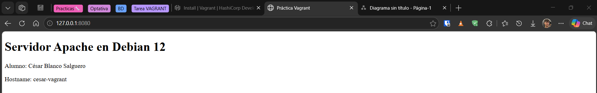

# BlancoSalguero_Cesar_tarea112_Vagrant 

## ¿Qué es Vagrant?
Es un software que crea una capa por encima de la virtualización, que permite automatizar la creación y configuración de máquinas virtuales mediante código (soluciona el problema de que algo funcione en una máquina, y en otra no). 

Permite que cualquier persona levante exactamente la misma máquina con el **comando** `vagrant up`.

### Conceptos Básicos:
* **Anfitrión (Host):** Equipo real donde ejecutamos Vagrant y los comandos.
* **Proveedor (Provider):** Es el hipervisor que ejecuta la máquina virtual (en mi caso VirtualBox).
* **Box:** Plantilla del sistema operativo con la que creamos la máquina virtual.
* **Maquina Virtual (Guest):** Es el equipo  virtualizado, donde se ejecuta un sistema aparte dentro de nuestro propio equipo, funciona como un equipo independiente, pero comparte los recursos disponibles con el nuestro, además se establece las caracteristicas de hardware que puede establecer nuestro equipo en este
* **Vagrantfile:** Archivo de configuración donde se describe y configura la máquina, el lenguaje en el que esta escrito es Ruby.

## ¿Qué es el aprovisionamiento (Provisioning)?
Es el proceso de automatizar la instalación de software, configuración de servicios y preparación del S.O. para que esté listo para usar, sin procesos manuales.

* **Provisioner:** Herramienta que usa Vagrant para realizar la tarea (*ejemplo: bash*).
* **¿Dónde se ejecuta el script?** Se ejecuta dentro de la VM.
* **¿Cuándo se lanza?** Vagrant lo ejecuta automáticamente la primera vez que se crea la máquina con `vagrant up`.
* **¿Cómo ejecutarlo de nuevo después de modificarlo?** Si modificamos el script, lo volvemos a lanzar con el comando `vagrant provision`.
* **Diferencia entre `inline` y `path`:**
    * `inline`: Se escriben los comandos bash directamente en una o varias líneas dentro del propio archivo `Vagrantfile`.
    * `path`: Indica la ruta a un script externo (*ejemplo: `conf.sh`*) que contiene todos los comandos que se ejecutarán en la máquina.

## Interfaces y Redes
### Red por defecto
Por defecto configura una red de tipo **NAT**, porque permite que la máquina tenga internet (para descargar paquetes) y además permite la comunicación mediante SSH para que vagrant controle la VM desde el host.

### Segunda Interfaz con IP fija
Se añade en el `Vagrantfile` usando `private_network` y poniendo la IP que se quiera poner. En VirtualBox la configuramos como red interna con `virtualbox__intnet: true`:
```ruby
config.vm.network "private_network", virtualbox__intnet: true, ip: "192.168.56.10"
```

### Direcciones y Rutas de Red
* **`eth0` (NAT):** Recibe la IP `10.0.2.15/24` y la ruta por defecto (`default via 10.0.2.2 dev eth0`) para la salida a internet.
* **`eth1` (Red Interna):** Recibe la IP fija `192.168.56.10/24` y la ruta directa a su subred (`192.168.56.0/24 dev eth1`).

```bash
vagrant@cesar-vagrant:~$ ip route
default via 10.0.2.2 dev eth0
10.0.2.0/24 dev eth0 proto kernel scope link src 10.0.2.15
192.168.56.0/24 dev eth1 proto kernel scope link src 192.168.56.10
```

#### Preguntas sobre las Interfaces
* **¿Añadir una segunda interfaz elimina la NAT predeterminada?** No, la NAT se sigue manteniendo en el primer adaptador (eth0) con su IP y salida a internet, mientras que la red interna se añade como un adaptador secundario (eth1).
* **¿El reenvío de puertos crea una interfaz nueva?** No, no crea ninguna interfaz, se aplica como una regla de redirección sobre la interfaz NAT existente.
### Comparativa con Tipos de Redes
* **NAT:** Permtie a la VM acceder a internet usando la IP del anfitrión, a no ser que se configure un reenvio de puertos.
* **Red Interna (VirtualBox):** Comunica solo las VM que pertenecen a la misma red interna, el host no tiene manera de comunicarse con la VM.
* **Red Privada Host-Only (VMWare):** Crea una red privada entre la VM y el host, esta red es unica y exclusivamente privada entre el host y la VM.
* **Red pública:** Conecta la VM a la red física, solicitando una IP como si fuese un equipo diferente.

### Reenvio de Puertos (Port Forwading)
Se usa para asociar un puerto del host a un VM, así puedes acceder a webs o aplicaciones de la VM desde el host u otros equipos. Que conste que esto no creo ninguna interfaz nueva y que lo unico que hace es poder acceder a la VM desde fuera con la IP del host.

## Órdenes y Carpetas Compartidas
| Comando | ¿Cuándo se usa? | ¿Ejecutado? |
| --- | --- | :---: |
| `vagrant up` | Crea y ejecuta la VM según el `vagrantfile`. | Sí |
| `vagrant status` | Comprueba el estado de la VM. | Sí |
| `vagrant ssh` | Abre una terminal en el host para controlar la VM. | Sí |
| `vagrant reload` | Reinicia la VM para aplicar cambios en el `vagrantfile`. | Sí |
| `vagrant provision` | Vuelve a ejecutar los scripts sin reiniciar la VM. | Sí |
| `vagrant halt` | Apaga la VM de manera ordenada. | Sí |
| `vagrant destroy` | Para y elimina la VM y sus discos. | Sí |
* `vagrant destroy`: Se usó para limpiar el entorno debido a un conflicto de proveedores al intentar arrancar inicialmente con VMware.
### ¿Que es `/vagrant`?
Es una carpeta compartida que esta entre el anfitrion y la VM. Dentro de la carpeta están los mismos archivos que tienes en la carpeta del proyecto del host (`vagrantfile`, `README.md`, scripts, etc.). Así puedes modificar algo desde el host y que automaticamente se refleje en la VM.
```BASH
cd /vagrant
-bash: cd: /vagrant: No such file or directory
```
#### Incidencia
Debido a hacerlo con `generic/debian12`, no instala el soporte de carpetas compartidas de `vboxsf`.
## Requisitos previos
Para reproducir esta práctica se necesita:
* Oracle VirtualBox instalado en el anfitrión.
* HashiCorp Vagrant instalado en el anfitrión.

## Esquema de Arquitectura


## Analisis `vagrantfile`
```ruby
#Parte donde se asigna la configuración del vagrantfile
Vagrant.configure("2") do |config|
    #Le ponemos el nombre al host (le ponemos mi nombre ya que se pide en la practica), lo podemos comprobar con `hostname`
    config.vm.hostname = "cesar-vagrant"
    #Indicamos que la VM sera una generica de debian 12 (es un requisito de la practica) y lo podemos comprobar con `cat /etc/os-release`
    config.vm.box = "generic/debian12"
    #Configuramos el reenvio del puerto 8080 al 80, para tener un acceso local aislado a la web y comprobado accediendo a la web desde el host usando el puerto :8080
    config.vm.network "forwarded_port", guest: 80, host: 8080, host_ip: "127.0.0.1"
    #Le ponemos una interfaz de red extra, configurada como RED PRIVADA (intnet) en Virtualbox y le asignamos la ip 192.168.56.10, es un requisito de la practica y lo podemos comprobar con `ip a`
    config.vm.network "private_network", virtualbox__intnet: true, ip: "192.168.56.10"
    #Le asignamos un script de aprovisionamiento (en mi caso llamado provision.sh) para instalar apache2 y crear el html, se puede comprobar con el `systemctl status apache2`
    config.vm.provision "shell", path: "provision.sh"
end
```
## Script Aprovisionamiento
```bash
#!/bin/bash

#Actualiza repositorios e instala apache2
apt-get update -y
apt-get install -y apache2

#Inicia el servicio de apache2
systemctl enable apache2
systemctl start apache2

#Creal el html, usa la variable $(hostname) para ver el nombre del host
cat <<EOF > /var/www/html/index.html
<!DOCTYPE html>
<html lang="es">
<head>
  <meta charset="UTF-8">
  <title>Práctica Vagrant</title>
</head>
<body>
  <h1>Servidor Apache en Debian 12</h1>
  <p>Alumno: César Blanco Salguero</p>
  <p>Hostname: $(hostname)</p>
</body>
</html>
EOF
```
## Capturas de Pantalla
### Interfaces de Red
Muestra las direcciones IP asignadas a las interfaces `eth0` (NAT: 10.0.2.15) y `eth1` (red interna: 192.168.56.10):

### Servicio Apache2
Muestra el estado activo y habilitado de Apache tras el aprovisionamiento:

### Acceso a la Web desde el Host
Muestra el acceso desde el navegador del host a `http://127.0.0.1:8080`, asegurando que funciona el reenvío de puertos, el html con el nombre y que es accesible desde el host

## Incidencias y Resolución
### Error de Comunicación con Vagrant VMware Utility y Cambio a VirtualBox

* **Problema inicial:** Al intentar arrancar con el proveedor vmware_desktop, Vagrant devolvió el error Failed to open TCP connection to 127.0.0.1:9922, debido a la falta del servicio en segundo plano vagrant-vmware-utility.
* **Causa:** Durante la instalación de la utilidad de VMware, el instalador no localizaba las claves en la rama de 32 bits (WOW6432Node). Aunque se copiaron las claves en el registro para solucionar la detección, el servicio requería inicialización de certificados locales y configuración adicional.
* **Resolución:** Para asegurar estabilidad, compatibilidad directa, y además no seguir perdiendo tiempo durante el desarrollo de la practica, tome la decision de usar Oracle VirtualBox como proveedor principal (--provider=virtualbox), logrando el levantamiento del box generic/debian12 y el acceso SSH de forma inmediata y sin incidencias. (Cuando tenga tiempo y sin ser de una tarea, lo seguire investigando y tratando solucionar los errores.), además esto justifica si en algún momento de la tarea se menciona el hacerlo con vmware, igual se me ha pasado borrarlo.

## Referencias
* **Apuntes de la asignatura (IAW):**
    * *IAW - Vagrant*:
        * Conceptos clave, ciclo de vida y comandos útiles (`up`, `reload`, `provision`, `ssh`, `halt`, `destroy`, `status`).
        * Configuración del archivo `Vagrantfile`, cajas (*boxes*) y hostname.
        * Configuración de redes (NAT, red privada y reenvío de puertos).
        * Aprovisionamiento mediante scripts Shell externos (`path: "..."`).
        * Carpetas sincronizadas (`/vagrant`).
* **Documentación oficial y enlaces específicos:**
    * [HashiCorp Vagrant — VirtualBox Provider](https://developer.hashicorp.com/vagrant/docs/providers/virtualbox) (Configuración avanzada y soporte de red interna `virtualbox__intnet`).
    * [HashiCorp Vagrant — Forwarded Ports](https://developer.hashicorp.com/vagrant/docs/networking/forwarded_ports) (Detalles de enlace exclusivo a `host_ip: "127.0.0.1"`).
    * [Debian GNU/Linux — generic/debian12 Box](https://app.vagrantup.com/generic/boxes/debian12) (Especificación de la imagen utilizada).
* **Resolución de incidencias (VMware Utility):**
    * [HashiCorp Vagrant — VMware Desktop Provider](https://developer.hashicorp.com/vagrant/docs/providers/vmware)
    * [HashiCorp Vagrant — VMware Utility](https://developer.hashicorp.com/vagrant/docs/providers/vmware/vagrant-vmware-utility)